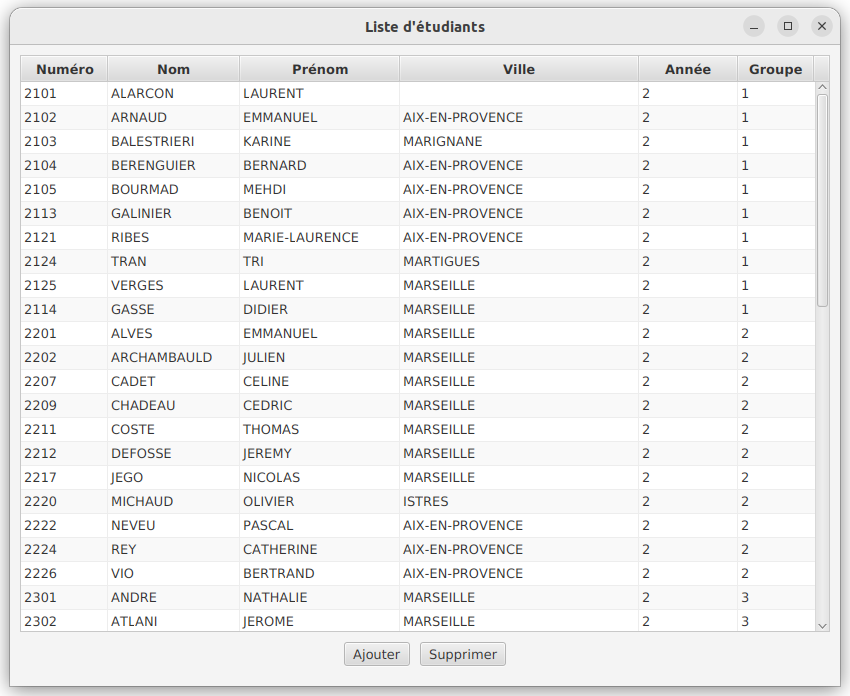

#  Développement d'application avec IHM

## IUT d’Aix-Marseille – Département Informatique Aix-en-Provence

- **Ressource :** [R2.02](https://cache.media.enseignementsup-recherche.gouv.fr/file/SPE4-MESRI-17-6-2021/35/5/Annexe_17_INFO_BUT_annee_1_1411355.pdf)
- **Responsables :**
  - [Sébastien Nedjar](mailto:sebastien.nedjar@univ-amu.fr)
- **Enseignants :**
  - [Cyril Pain-Barre](mailto:cyril.pain-barre@univ-amu.fr)
  - [Sophie Nabitz](mailto:sophie.nabitz@univ-avignon.fr)
- **Besoin d'aide ?**
  - Consulter et/ou créer des [issues](https://github.com/IUTInfoAix-R203/tp1-git/issues).
  - [Email](mailto:sebastien.nedjar@univ-amu.fr) pour une question d'ordre privée, ou pour convenir d'un rendez-vous physique.

## Aperçu du TP et objectifs d'apprentissage

En plus d'apprendre à utiliser JPA, l'objectif de ce TP est de sensibiliser les étudiants à la difficulté de construction et de maintenance d'une couche de persistance des données.

## Création d'une couche de persistance en Java

L’objectif de ce TP est de présenter une méthode d’accès à un SGBD à travers le langage de programmation Java. Pour cela, l’API JDBC ([Java DataBase Connectivity](https://en.wikipedia.org/wiki/Java_Database_Connectivity)) sera utilisée. C’est un ensemble de classes permettant d’exécuter des ordres SQL de manière générique. L’API JDBC est construite autour de pilotes (Driver) interchangeables. Un pilote est un module logiciel dédié à une source de données tabulaires (un SGBD Relationnel dans la plupart des cas). Pour utiliser comme source de données une base MySQL au lieu d’une base Oracle, il suffit de remplacer le pilote Oracle par celui de MySQL ou Postgres. Ce changement de pilote peut se faire directement par paramétrage sans même avoir besoin changer le code ni même le recompiler (Il faut tout de même pondérer ces avantages, car dans la pratique, il existe de très nombreuses incompatibilités liées à des implémentations du langage SQL non respectueuses des standards).

Pour éviter le travail bas niveau de l'écriture d'une couche de persistance avec JDBC, JPA sera présenté et utilisé.

## Création de votre fork du TP

La première chose que vous allez faire est de créer un fork d'un dépôt. Pour ce faire, rendez-vous sur le lien suivant :

<https://classroom.github.com/a/TUMM9ZKv>

GitHub va vous créer un dépôt contenant un fork du dépôt 'IUTInfoAix-R202/tp4' et s'appelant 'IUTInfoAix-R202-2022/tp4-votreUsername'. Vous apparaîtrez automatiquement comme contributeur de ce projet pour y pousser votre travail.

Une fois votre fork créé, il suffit de l'importer dans un IDE pour faire le TP. La réalisation du TP étant notée, veillez à pousser vos modifications régulièrement.

## Travail préalable avec JDBC

L’objectif de ce document est de vous présenter une méthode d’accès à un SGBD Relationnel à travers le langage de programmation `Java`. Pour cela, nous allons dans un premier temps présenter l’API JDBC ([Java DataBase Connectivity](https://docs.oracle.com/en/java/javase/17/docs/api/java.sql/java/sql/package-summary.html)). C’est un ensemble de classes permettant d’exécuter des ordres SQL de manière générique. En effet, l’API JDBC est construit autour de pilotes (Driver) interchangeables. Un pilote est un module logiciel dédié à une source de données tabulaire (un SGBD-R dans la plupart des cas). Pour utiliser comme source de données MySQL au lieu d’Oracle, il suffit de remplacer le pilote Oracle par celui de MySQL. Ce changement de pilote peut se faire directement par paramétrage sans avoir besoin changer une seule ligne de code ni le recompiler (Il faut tout de même pondérer ces avantages, car dans la pratique, il existe de très nombreuses incompatibilités liées à des implémentations du langage SQL non respectueuses des standards).

### Mise en place de l’environnement de travail

L’API JDBC fait partie de Java, mais le pilote propre au SGBD-R n’y est pas. Avant de pouvoir se connecter à une base de données, il faudra donc ajouter à votre projet le fichier _jar_ contenant le pilote adapté. Si vous utilisez un projet Maven, l'ajout se fera par l'insertion d'une nouvelle dépendance dans le fichier `pom.xml` de votre projet.

### Traitement d’un ordre SQL avec JDBC

L’objectif général de cette partie est de mettre en évidence le schéma de fonctionnement classique de l’API Java d’interaction avec les bases de données relationnelles. Le principe de fonctionnement de cette API est proche de celle d'autres langages objets comme PHP ou C\#. D’une manière générale, pour traiter un ordre SQL avec JDBC, il faudra suivre les étapes suivantes :

1. Connexion à la base de données.

2. Création d’une instruction SQL.

3. Exécution de la requête.

4. Traitement de l’ensemble des résultats.

5. Libération des ressources et fermeture de la connexion.

Étant donné que chacune de ses étapes est susceptible de rencontrer des erreurs, il faudra donc rajouter une étape supplémentaire de gestion des exceptions.

Pour illustrer ce propos, nous utiliserons la base de données « Gestion Pédagogique » que vous avez utilisée lors de vos TP de PL/SQL en début d’année. Dans le présent dépôt, vous pourrez trouver un script de génération des tables adapté à MySQL ou Oracle.

En créant votre environement de dévelopement avec gitpod, vous aurez accès à un serveur MySQL déjà configuré. Pour pouvoir travailler avec votre propre base de données, vous pouvez essayer de créer une instance d'une base de donnée PostgreSQL chez [Elephant SQL](https://www.elephantsql.com/plans.html). Que ce soit sur l'une ou l'autre solution, une fois votre instance créée, vous pourrez récupérer votre URL de connexion dans votre console d'administration.

Le programme Java ci-dessous va être utilisé pour illustrer le fonctionnement de chacune de ces étapes. L’objectif de ce programme est de récupérer la liste des numéros, noms et prénoms de tous les étudiants habitant à Aix-en-Provence pour l’afficher à l’écran.

```java
// Importer les classes jdbc
import java.sql.*;
public class exempleJDBC {
    // Chaîne de connexion
    static final String CONNECT_URL = "jdbc:postgresql://tyke.db.elephantsql.com/maBD";
    static final String LOGIN = "monUser";
    static final String PASSWORD = "monPassword";
    
    // La requête de test
    static final String req = "SELECT NUM_ET, NOM_ET, PRENOM_ET " +
                              "FROM ETUDIANT " +
                              "WHERE VILLE_ET = 'AIX-EN-PROVENCE'";
    public static void main(String[] args) {
        // Connexion a la base
        System.out.println("Connexion a " + CONNECT_URL);
        try (Connection conn = DriverManager.getConnection(CONNECT_URL,LOGIN,PASSWORD)){
            System.out.println("Connecte\n");
            // Creation d'une instruction SQL
            Statement stmt = conn.createStatement();
            
            // Execution de la requête
            System.out.println("Execution de la requête : " + req );
            ResultSet rset = stmt.executeQuery(req);
            
            // Affichage du résultat
            while (rset.next()){    
                System.out.print(rset.getInt("NUM_ET") + " ");
                System.out.print(rset.getString("NOM_ET") + " ");
                System.out.println(rset.getString("PRENOM_ET"));
            }
            
            // Fermeture de l'instruction (libération des ressources)
            stmt.close();
            System.out.println("\nOk.\n");
        } catch (SQLException e) {
            //Ceci n'est pas une gestion réaliste des erreurs
            e.printStackTrace();// Arggg!!!
            System.out.println(e.getMessage() + "\n");
        }
    }
}
```

Les différentes étapes détaillées ci-dessous mentionnent de nombreuses classes contenues dans les paquetages `java.sql.*` et `javax.sql.*`. Pour connaître les détails sur chacune de ces classes, vous êtes invités à lire la Javadoc que vous trouverez à l’adresse suivante : <https://docs.oracle.com/en/java/javase/17/docs/api/index.html>.

#### Connexion à la base de données

La première étape qui permet d’interagir avec une base de données est la connexion. Il faut initialiser un objet du type `Connection` grâce à la méthode `getConnection()` de la classe `DriverManager`.

#### Création d’une instruction SQL

Une fois la connexion établie, il faut créer un objet matérialisant l’ordre SQL à exécuter. Cet objet du type `Statement` est obtenu en appelant la méthode `createStatement()` de notre connexion. Il existe trois types d’ordre :

1. Les `Statement` : Ils permettent d’exécuter n’importe quelle requête sans paramètre. La requête est interprétée par le SGBD au moment de son exécution. Ce type d’ordre est à utiliser principalement pour les requêtes à usage unique.

2. Les `PreparedStatement` : Ils permettent de pré-compiler un ordre avant son exécution. Ils sont particulièrement importants pour les ordres destinés à être exécutés plusieurs fois comme les requêtes paramétrées.

3. Les `CallableStatement` : Ils sont destinés à l’appel des procédures stockées.

#### Exécution de la requête

Afin d’exécuter une requête, il suffit de faire appel à l’une des méthodes `executeXXXX()` de l’objet `Statement` que l’on vient de créer. Dans l’exemple ci-dessus on utilise la méthode `executeQuery()` en lui passant en paramètre une chaîne de caractères (`string`) contenant la requête (comme `Execute Imediate` de PL/SQL). Cette méthode retourne un objet du type `ResultSet` contenant l’ensemble des résultats de la requête. Il faut noter que si l’ordre SQL est une mise à jour des données (`Insert`, `Update`, `Delete`), il faudra alors l’exécuter avec la méthode `executeUpdate()` qui retourne un entier correspondant au nombre de lignes impactées par la mise à jour.

#### Traitement de l’ensemble des résultats

La manipulation du résultat d’une requête se fait à travers un objet du type `ResultSet`. Le résultat se manipule, comme avec les curseurs de PL/SQL, ligne après ligne. Ainsi, l’objet `ResultSet` maintient un pointeur vers la ligne courante. La manipulation de ce pointeur se fait principalement avec la méthode `next()` qui permet d’avancer le pointeur sur la ligne suivante. Lors de la création du `ResultSet` ce pointeur est positionné sur une ligne spéciale appelée le _gap_. Cette ligne est située une ligne avant la première ligne du résultat. De ce fait, la première ligne n’est pointée qu’après le premier appel à `next()`. Lorsque le pointeur est positionné après la dernière ligne, `next()` retourne la valeur `false`. Pour parcourir linéairement l’intégralité d’un `ResultSet`, on utilise donc une boucle `while` avec `next()` comme prédicat de continuation. Le corps de la boucle est dédié à la manipulation de la ligne (tuple) couramment pointée.

Afin de récupérer les valeurs des attributs du tuple courant, on utilise l’une des différentes méthodes `getXXXX()` (où `XXXX` désigne le type de l’attribut que l’on souhaite récupérer). Par exemple, pour récupérer un entier, on utilise `getInt()` et pour récupérer un booléen on utilise `getBoolean()`. Le paramètre passé à cet accesseur permet de choisir l’attribut à récupérer. Il existe deux façons pour désigner un attribut. La première (celle de l’exemple) consiste à utiliser une `string` contenant le nom de la colonne souhaitée. La seconde quant à elle, passe en paramètre un entier (`int`) contenant la position (dans le `Select`) de l’attribut à récupérer. Attention, contrairement à l’habitude en programmation, les attributs sont numérotés à partir de 1 (et non de 0). Par exemple, si l’on souhaite récupérer la valeur de l’attribut `NUM_ET` (le premier dans notre `Select`), il faudra faire : `rset.getInt(1)`.

#### Libération des ressources et fermeture de la connexion

Tant que l’on utilise un `Statement` ou une `Connection`, le système nous alloue un certain nombre de ressources. Maintenir ces ressources disponibles a un coût non négligeable. Ainsi, comme toujours en informatique, pour éviter le gaspillage (et donc un ralentissement inutile) il faut libérer les ressources dès qu’elles ne sont plus nécessaires. Pour ce faire, il suffit d’appeler la méthode `close()` des objets `Statement` et `Connection`.

#### Gestion des exceptions

La grande majorité des classes de JDBC sont susceptibles de lever des exceptions lorsqu’elles rencontrent des erreurs. C’est pour cela qu’il faut toujours encadrer le code JDBC par un bloc `try/catch`. Les exceptions levées sont toutes des classes filles de `SQLException`.

#### Question 0
Ouvrir la classe `ExempleJDBC`, personnaliser les informations de connexion et l'exécuter. Prennez le temps de bien comprendre l'exemple avant de continuer.

## Gestion de la persistance des données avec JPA

Dans la première étape TP nous avons vu comment construire une couche DAO pour simplifier et uniformiser l’accès aux données. L’énorme avantage d’une telle couche est de fournir une couche d’abstraction intermédiaire relativement générique et interchangeable. Ainsi le passage d’une technologie de persistance à une autre peut se faire en remplaçant uniquement cette couche intermédiaire. Nous avons aussi constaté que l’écriture des classes DAO simplistes avec JDBC était une tache longue, fastidieuse et rébarbative. L’objectif de cette étape est d’utiliser JPA pour simplifier l’écriture des DAO et aussi améliorer la fiabilité et la souplesse de notre couche de persistance.

Pour découvrir le support de JPA dans IntelliJ, vous pouvez lire le guide suivant :
<https://blog.jetbrains.com/idea/2021/02/creating-a-simple-jakarta-persistence-application/>

Avant de continuer, faire le [tutoriel de découverte de JPA](https://github.com/IUTInfoAix-R202/tutoJPA/blob/main/README.md).


### Configuration de l’unité de persistance

Comme toujours avec un projet JPA, vous devez commencer par configurer les paramètres d’accès à la base de données.

Le fichier `src/main/resources/META-INF/persistence.xml` devra ressembler à ceci :

```xml
<?xml version="1.0" encoding="UTF-8" ?>

<persistence xmlns="https://jakarta.ee/xml/ns/persistence" xmlns:xsi="http://www.w3.org/2001/XMLSchema-instance" version="3.0">
  <persistence-unit name="gestionPedaPU" transaction-type="RESOURCE_LOCAL">
    <provider>org.eclipse.persistence.jpa.PersistenceProvider</provider>

    <class>fr.univ_amu.iut.entity.Etudiant</class>
    <class>fr.univ_amu.iut.entity.Module</class>
    <class>fr.univ_amu.iut.entity.Prof</class>

    <properties>
      <!-- database connection properties -->
      <property name="jakarta.persistence.jdbc.url" value="jdbc:derby:memory:employeBD;create=true"/>
      <property name="jakarta.persistence.jdbc.user" value=""/>
      <property name="jakarta.persistence.jdbc.password" value=""/>

      <!-- database creation properties -->
      <property name="jakarta.persistence.schema-generation.database.action" value="drop-and-create" />

      <property name="jakarta.persistence.schema-generation.create-source" value="script"/>
      <property name="jakarta.persistence.schema-generation.create-script-source" value="META-INF/sql/create-db.sql" />

      <property name="jakarta.persistence.schema-generation.scripts.drop-source" value="script"/>
      <property name="jakarta.persistence.schema-generation.scripts.drop-target" value="META-INF/sql/drop-db.sql"/>

      <property name="jakarta.persistence.sql-load-script-source" value="META-INF/sql/data.sql"/>

      <!-- configure logging -->
      <property name="eclipselink.logging.level" value="INFO"/>
      <property name="eclipselink.logging.level.sql" value="FINE"/>
      <property name="eclipselink.logging.parameters" value="true"/>
    </properties>
  </persistence-unit>
</persistence>
```

Remarquez que contrairement au code donné pour les SAE, nous ne demandons pas à JPA de nous créer les tables par lui-même, à la place, nous lui fournissons les scripts SQL de création et de remplissage de la base de données. L’une des principales difficultés de ce TP sera de configurer le mapping des entités pour qu’il corresponde aux relations présentes dans la BD. Comme vous allez le voir, la BD ne satisfaisant pas à la convention par défaut de JPA, il faudra rajouter beaucoup d’annotations.

### Annotations des entités

La configuration du mapping dans JPA peut se faire grâce au mécanisme des annotations Java. Une annotation est une information permettant d’enrichir la sémantique d’une classe sans modifier son code. Nous avons déjà rencontré plusieurs d’entre elles :

- `@jakarta.persistence.Entity` permet à JPA de reconnaître cette classe comme une classe persistante (une entité) et non comme une simple classe Java.

- `@jakarta.persistence.Id`, quant à elle, définit l’identifiant unique de l’objet. Elle donne à l’entité une identité en mémoire en tant qu’objet, et en base de données via une clé primaire. Les autres attributs seront rendus persistants par JPA en appliquant la convention suivante : le nom de la colonne est identique à celui de l’attribut et le type String est converti en `VARCHAR(255)`.

- `@jakarta.persistence.GeneratedValue` indique à JPA qu’il doit gérer automatiquement la génération automatique de la clef primaire.

- `@jakarta.persistence.Column` permet de préciser des informations sur une colonne de la table : changer son nom (qui par défaut porte le même nom que l’attribut), préciser son type, sa taille et si la colonne autorise ou non la valeur nulle.

- `@jakarta.persistence.Embedded` précise que la donnée membre devra être intégrée dans l’entité.

- `@jakarta.persistence.Embeddable` précise que la donnée membre peut être intégrée dans une entité.

- L’annotation `@jakarta.persistence.OneToOne` indique à JPA que la donnée membre est une association 1:1.

- L’annotation `@jakarta.persistence.ManyToOne` indique à JPA que la donnée membre est une association N:1.

- L’annotation `@jakarta.persistence.OneToMany` indique à JPA que la donnée membre est une association 1:N.

- L’annotation `@jakarta.persistence.ManyToMany` indique à JPA que la donnée membre est une association N:M.

#### Question 1

En vous inspirant de la classe `Etudiant`, annotez `Prof` et `Module` pour qu’elles soient correctement mises en correspondance avec leur relation respective. Dans cette question **les associations seront ignorées** pour le moment. Pour pouvoir tester votre code, il faut rajouter l’annotation `@Transient` devant la déclaration de la donnée membre matérialisant l’association.

#### Question 2

Copier la classe `ExempleJPA` dans la nouvelle classe `AfficheEntite`. Modifier le code de cette classe pour qu’elle récupère l’étudiant dont le `NUM_ET` est 1106 et l’affiche sur la sortie standard.

#### Question 3

Copier la classe `ExempleJPA` dans la nouvelle classe `AjouteEntite`. Modifier le code de cette classe pour qu’elle crée un nouveau module, l’affiche, attend 1 minute et le supprime de la base de données. Vérifier en parallèle dans la console SQL que l’ajout et la suppression ont bien lieu.

### Mapping des associations

Dans le cours et l'étape 1, nous avons vu comment les associations étaient implémentées en Java. En UML les associations ont une propriété supplémentaire, la navigabilité. En effet, contrairement au relationnel, une association peut n’être accessible qu’à l’une de ses extrémités. De manière générale, une association bidirectionnelle peut être vue comme une paire d’associations unidirectionnelles de sens opposé. Chacune d’elle peut, comme dans le contexte BD, être classées par rapport aux cardinalités en UML de chaque rôle :

- Many-to-one pour les associations hiérarchiques (au sens du MCD) qui à une entité départ associe au plus une seule entité cible et une entité cible peut être associée à plusieurs sources.

- One-to-one pour les associations hiérarchiques (au sens du MCD) qui à une entité départ n’associe qu’une seule entité cible et une entité cible est associé à au plus une source.

- One-to-many pour les associations hiérarchiques (au sens du MCD) qui à une entité départ associe plusieurs entités cibles et une entité cible est associé à au plus une source.

- Many-to-many pour les associations qui à une entité départ associe plusieurs entités cibles et une entité cible peut être associée à plusieurs sources.

Du point de vue de la source, les deux premières peuvent être implémentées par une simple donnée membre référençant vers l’entité associée. Elles sont donc appelées associations monovaluées (ou Single-valued associations). Les deux dernières doivent utiliser une collection pour matérialiser tous les liens, on les nomme associations multivaluées (ou *Collection-valued* associations).

### Single-valued associations

Dans le diagramme de classe UML, il y a trois associations hiérarchiques : *“A pour père”*, *“Est spécialiste”* du point de vue de la classe `Prof` et *A pour responsable* du point de vue de la classe `Module`.

Ce type d’association s’implémente avec l’annotation `@ManyToOne`. En relationnel, elles s’implémentent par l’ajout d’une clef étrangère du côté de la source de l’association. La convention en JPA pour nommer cet attribut est `<nom de la table d’origine>_<nom de la clef primaire>`. Par exemple la relation `DEPARTEMENT` a une clef appelée `ID` donc la clef étrangère dans `EMPLOYE` s’appelle `DEPARTEMENT_ID`. Dans le cas où la clef n’a pas le nom conventionnel, il faut préciser le nom de l’attribut clef étrangère (aussi appelé attribut de jointure) avec l’annotation `@JoinColumn`. Celle-ci possède un attribut `name` comme `@Column`. Elle doit être placée juste devant la donnée membre matérialisant l’association.

#### Question 4

Annoter les entités pour que les associations *“A pour père”*, *A pour responsable* et *“Est spécialiste”* (pour l’instant, on considère cette dernière comme unidirectionnelle) soient correctement mises en correspondance avec la base de données (N’oubliez pas que la BD ne respecte pas la convention JPA et qu’il faut donc configurer le mapping).

#### Question 5

Copier la classe `ExempleJPA` dans la nouvelle classe `AfficheResponsable`. Modifier le code de cette classe pour qu’elle récupère la matière BD et affiche l’enseignant qui en est responsable sur la sortie standard. Soyez vigilant que vos méthodes `toString()` n’essaient pas d’afficher tout le graphe des objets.

#### Question 6 (Optionnelle)

Copier la classe `ExempleJPA` dans la nouvelle classe `AfficheHierarchieModules`. Modifier le code de cette classe pour qu’elle récupère la matière BD et affiche récursivement la hiérarchie des modules de cette matière. Observer la console pour bien comprendre comment EclipseLink charge chacun des modules de cette hiérarchie.

Pour éviter que toutes les associations soient chargées dès la première utilisation, les annotations `OneToOne`, `ManyToOne`, `OneToMany` et `ManyToMany` ont un attribut `fetch` qui permet de demander d’effectuer un chargement à la demande (si `fetch=FetchType.LAZY`) ou un chargement immédiat (si `fetch=FetchType.EAGER`). Cette possibilité évite par exemple que l’ensemble des modules et leur responsable soit chargé lorsque l’on charge une seule matière.

Dans le cas des associations 1:1 bidirectionnelle, pour paramétrer le second coté (celui qui ne possédera pas nécessairement de clef étrangère dans la BD), il faut rajouter à l’annotation `@OneToOne` l’attribut `mappedBy`. Il indique le nom de la donnée membre utilisée par l’entité liée pour matérialiser l’association dans le sens opposé.

### Collection-valued associations

Comme indiqué ci-dessus, les associations 1:N et M:N doivent associer à une entité plusieurs autres. Dans ce cas, la donnée membre matérialisant l’association devra être une collection. Par exemple avec une [base de données de gestion des employés](https://github.com/eclipse-ee4j/eclipselink-examples/blob/master/jpa/employee/employee.model/src/main/java/eclipselink/example/jpa/employee/model/), si nous souhaitons rendre l’association *“à pour département”* navigable dans le sens `Departement` vers `Employe`, nous devons rajouter dans la classe `Departement` une donnée membre et les accesseurs suivants :

``` java
private Collection<Employe> employes;

public Collection<Employe> getEmployes() {
    return employes;
}

public boolean add(Employe e) {
    return employes.add(e);
}

public boolean remove(Object o) {
    return employes.remove(o);
}
```

Pour paramétrer cette association, il faut lui rajouter l’annotation `@OneToMany` à laquelle on doit préciser le type de l’entité lié et le nom de la donnée membre matérialisant l’association dans l’autre sens. Pour notre exemple, la déclaration de `employes` deviendrait :

``` java
@OneToMany(targetEntity=Employe.class, mappedBy="departement", fetch=FetchType.EAGER)
private Collection<Employe> employes;
```

Notons qu’il y a deux points importants à se souvenir quand on définit une association `one-to-many` bidirectionnelle :

- Le côté many-to-one est le propriétaire de l’association, l’attribut de jointure (`@JoinColumn`) est donc situé de ce côté.

- Le côté one-to-many est le côté inverse donc l’attribut `mappedBy` doit être utilisé.

Si l’on oublie de spécifier l’attribut `mappedBy` dans l’annotation `@OneToMany`, JPA considérera l’association `one-to-many` comme unidirectionnelle et s’attendra à trouver une table de jointure dont le nom est constitué de la concaténation des noms des entités liées.

#### Question 7 (Optionnelle)

Modifier et annoter l’entité `Module` pour que l’association *“Est spécialiste”* soit bidirectionnelle.

#### Question 8 (Optionnelle)

Copier la classe `ExempleJPA` dans la nouvelle classe `AfficheSpécialistes`. Modifier le code de cette classe pour qu’elle récupère la matière BD et affiche tous les spécialistes de cette matière.

Le dernier type d’association qu’il nous reste à étudier sont les associations *many-to-many*. Pour ces associations en relationnel on utilise des relations dites de jointure. De manière générale, elles sont naturellement bidirectionnelles à cause de cette implémentation relationnelle (même si l’on peut restreindre la navigabilité). Comme pour les associations *one-to-many* bidirectionnelles, l’un des côtés doit porter l’attribut `mappedBy` dans l’annotation `@ManyToMany`. Le côté qui porte cet élément est dit coté inverse alors que le côté qui en est dépourvu sera le propriétaire. Chaque côté de l’association doit être doté d’une collection la matérialisant.

Le paramétrage de la table de jointure utilisée se fait grâce à l’annotation `@JoinTable` du côté de l’entité propriétaire. Cette annotation possède trois attributs importants :

- `name` qui indique le nom de la table de jointure.

- `joinColumns` qui spécifie l’attribut de la table de jointure qui est une clef étrangère vers l’entité propriétaire. Cet élément prend pour valeur une annotation `@JoinColumn` pour donner tous les paramètres de l’attribut de jointure.

- `inverseJoinColumns` qui spécifie le nom de l’attribut de la table de jointure qui est une clef étrangère vers l’entité située coté inverse. De même que `joinColumns`, cet élément se paramètre avec une annotation `@JoinColumn`.

### Construction de la couche d’accès aux données avec JPA

Dans ce paragraphe, nous allons, comme dans l'étape précédente, construire une couche dédiée à l’accès aux données qui utilisera le pattern [DAO (Data Access Object)][3]. Cette couche encapsulera tous les accès à la source de données. Les autres parties de l’application utiliseront uniquement les objets de cette couche pour gérer la persistance.

Chacune d’elles devra contenir des méthodes pour effectuer les 4 opérations de base pour la persistance des données : *créer, récupérer, mettre à jour et supprimer*. Par convention, chacune des classes de DAO devra être nommée par “`DAO`” suivi du nom de la classe métier associée.

L’objectif est d’écrire le code permettant de faire communiquer le modèle objet et le modèle relationnel. Écrire un tel code avec JDBC est une activité, longue, fastidieuse et risquée. Utiliser directement JDBC à chaque accès aux données produirait deux effets très négatifs :

- Une pollution importante du code métier par du code JDBC. Cela implique donc une moins grande lisibilité du code et ainsi un risque d’erreur plus important.

- Une moins grande indépendance vis-à-vis du SGBD. L’intrication forte entre code métier et code d’accès aux données rend le changement de SGBD (par exemple le remplacement d'Oracle par Postgres) très délicat voir impossible.

Pour éviter ces problèmes, nous allons construire une couche dédiée à l’accès aux données qui utilisera le pattern [DAO][14] (Data Access Object). Cette couche encapsulera tous les accès à la source de données. Les autres parties de l’application utiliseront uniquement les objets de cette couche pour gérer la persistance. Elle sera donc une sorte d’abstraction du modèle de données indépendante de la solution de stockage des données. La couche DAO contiendra au moins autant de classes de DAO que d’entités du MCD (classe d’objet métier). L’écriture et la maintenance d’une telle couche est une opération généralement fastidieuse. C’est l’une des raisons pour lesquelles les solutions de persistance actuelles génèrent automatiquement une grande partie du code (Java et/ou SQL).

### Structure d'un DAO

Chacun des DAO devra contenir des méthodes pour effectuer les 4 opérations de base pour la persistance des données : *créer, récupérer, mettre à jour et supprimer* (Généralement désigné par l’acronyme anglais CRUD pour *Create, Retrieve, Update et Delete*).Par convention, chacune des classes de DAO devra être nommée par "`DAO`" suivi du nom de la classe métier associée. La figure ci-dessous donne la classe `DAOEtudiantJDBC` qui est le DAO associé à la classe d’objet métier `Etudiant`.


Cette classe est constituée des méthodes suivantes :

- `insert` qui à pour objectif de créer un nouvel étudiant dans la base de données. L’identifiant d’un tuple ne pouvant être connu avant son insertion, cette méthode retourne une copie de l’objet métier passé en paramètre avec un identifiant définitif. L’identité d’un objet dépendant uniquement de l’identifiant, un objet métier créé localement avec le constructeur par défaut (objet temporaire sans identité propre du point de vue de `equals()` et `hashCode()`) ne devra participer à aucune association avant d’être inséré dans la base avec cette méthode (Ces objets sans identité jouent le rôle des objets de transfert de données (*Data Transfer Object*) du pattern DAO original).

- `update` qui prend un objet métier en paramètre et essaie faire la mise à jour dans la base de données. La valeur retournée par cette méthode indique si la mise à jour a pu avoir lieu.

- `delete` qui prend un étudiant en paramètre et essaie de le supprimer de la base de données. La valeur retournée par cette méthode indique si la suppression a pu avoir lieu.

- les `get` qui constituent, avec les `find`, les méthodes de récupération des données. Les paramètres passés à ces méthodes permettent de récupérer uniquement les tuples satisfaisants certains critères. La différence entre ces deux familles de méthodes est que les `get` doivent retourner exactement un seul résultat alors que les `find` peuvent en retourner plusieurs.

- les `compute` qui, comme leur nom l’indique, ont pour objectif d’effectuer des calculs sur les tuples. La plupart du temps (sauf si le calcul demande de ne rapatrier aucune donnée) on préférera, pour des raisons d’efficacité, le faire directement dans le SGBD. Ces méthodes sont donc soit des requêtes SQL agrégatives soit des appels de procédures stockées.

### Utilisation d'un DAO

En utilisant `DAOEtudiant`, la récupération par l’application de l’étudiant d’identifiant 1 dans la base de données se déroule comme suit :

1. L’application demande un objet `Etudiant` correspondant au tuple d’identifiant 1 dans la base de données à l’unique instance de `DAOEtudiant`. L’objet `DAOEtudiant` récupère cette demande (méthode `getByID(1)` ) et il s’occupe d’exécuter la requête SQL.

3. Le SGBD interprète la requête SQL et retourne le résultat attendu (s’il existe).

4. L’objet `DAOEtudiant` récupère ces informations.

5. L’objet `DAOEtudiant` instancie un objet `Etudiant` avec les données récupérées.

6. Enfin, l’objet `DAOEtudiant` retourne l’instance de l’objet `Etudiant`.

Cette séquence d’opération illustre bien le rôle central de l’objet DAO dans l’accès aux données. Les opérations de mise à jour et de suppression se dérouleront à peu près de la même manière. Pour l’insertion d’un nouveau tuple, il faudra d’abord créer un objet sans identité (avec le constructeur par défaut) puis appeler la méthode `insert()` qui nous retournera notre objet définitif (avec un identifiant valide). Le code ci-dessous illustre l’utilisation typique du DAO pour l’ajout d’un nouvel étudiant et sa modification :

```java
public class Main {
  public static void main(String[] args){
    DAOEtudiant dao = new DAOEtudiantJDBC();
    Etudiant e = new Etudiant();//e est un Etudiant temporaire
    e.setNom("Dupont");
    e.setPrenom("Paul");
    e.setCp("13100");
    e.setVille("Aix-en-Provence");
    e.setAnnee(1);//Modification des attributs de e 
    e.setGroupe(5);
    e = dao.insert(e);//e referencie maintenant un Etudiant definitif
    //...
    e.setAnnee(2);// Modification des attributs de e 
    e.setGroupe(3);
    //...
    boolean updateOk = dao.update(e);//Sauvegarde des modifications
    //...
  }
}
```

#### Hiérarchie des DAO

Tous les DAO de notre application ont un certain nombre de méthodes communes. Pour améliorer l’indépendance du code client vis-à-vis de la couche de persistance, nous ajoutons une interface `DAO` que tous les objets DAO devront implémenter. Les objets métiers dépendront ainsi d’une interface et non d’une implémentation particulière. La figure ci-après donne le diagramme de classe de l’ensemble des DAO de l’application gestion pédagogique. Dans sa version complète, le pattern présenté utilise des `AbstractFactory` pour améliorer encore la modularité de la couche de persistance.


#### Question 9

En vous inspirant de l'exemple de DAO présenté dans le [cours de persistance](https://github.com/IUTInfoAix-R202/cours/blob/main/cours4/cours4.pdf), terminez d'implémenter la classe `DAOEtudiantJPA` respectant le contrat de l'interface `DAOEtudiant`.

#### Question 10
Maintenant que l'on dispose d'une couche de persistance, nous allons créer une interface graphique permettant d'afficher le contenu de la relation `ETUDIANT`. Pour ce faire, nous allons utiliser la classe [`TableView`](https://openjfx.io/javadoc/17/javafx.controls/javafx/scene/control/TableView.html).

Le composant `TableView` permet de gérer facilement les données tabulaires. Pour ce faire, il faut donner le type à manipuler comme paramètre de généricité. Une fois cela fait, il faut créer les colones avec le type de chaque attribut. Les données seront simplement ajoutées à partir d'une liste.

Dans le paquetage `fr.univ_amu.iut`, ouvrir la classe `AfficherLesEtudiants` et l'implémenter en respectant les consignes suivantes :

- Écrire la méthode `initialiserColonneNumero()` qui crée un objet `TableColumn<Etudiant, Integer>` ayant pour nom "Numéro". Sur cet objet ajouter une factory de création de cellule en utilisant la classe `PropertyValueFactory` qui s'occupera d'appeler la méthode `getNumEt()`.
- De la même manière, écrire les méthodes `initialiserColonneNom()`, `initialiserColonnePrenom()`, `initialiserColonneVille()`, `initialiserColonneAnnee()`, `initialiserColonneGroupe()` qui initialiseront toutes les autres colones.
- Écrire la méthode `initialiserColonnes()` qui appelle les méthodes précédentes pour initialiser toutes les données membres associées aux colones.
- Écrire la méthode `insererColonnes()` qui ajoute les colones précédemment crées à la table.
- En utilisant la classe `DAOEtudiantJPA`, implémenter la méthode `listerEtudiants()` pour récupérer la liste de tous les étudiants et la transformer en une liste observable avec la méthode statique `FXCollections.observableList()`.
- Implémenter la méthode `remplirDonnees()` qui s'occupe d'insérer la liste crée par la méthode précédente dans la table.
- Écrire la méthode initialiserTable() qui crée l'objet `TableView`. Cette table devra créer les colones et les ajouter à la table. Les données seront chargées avec la méthode précédente.
- Dans la méthode `start`, ajouter les différents composants pour avoir une fenêtre similaire à celle ci-après :



[1]:<http://www.hibernate.org/>

[2]:<http://www.eclipse.org/eclipselink/>

[3]:<https://github.com/IUTInfoAix-R202/TutoJdbc>

[4]:<http://fr.wikipedia.org/wiki/Transaction_informatique>

[5]:<http://fr.wikipedia.org/wiki/Singleton_%28patron_de_conception%29>

[6]:<http://uml.free.fr/>

[7]:<https://fr.wikipedia.org/wiki/Objet_d%27acc%C3%A8s_aux_donn%C3%A9es>

[8]:<http://fr.wikipedia.org/wiki/S%C3%A9rialisation>

[9]:<http://download.oracle.com/javase/17/docs/api/java/lang/Object.html>

[10]:<http://docs.oracle.com/javase/17/docs/api/java/util/ArrayList.html>

[11]:<http://java.sun.com/developer/onlineTraining/collections/Collection.html#SetInterface>

[12]:<http://java.sun.com/developer/onlineTraining/collections/Collection.html#MapInterface>

[13]:<http://download.oracle.com/javase/17/docs/api/java/lang/Object.html>

[14]:<https://fr.wikipedia.org/wiki/Objet_d%27acc%C3%A8s_aux_donn%C3%A9es>
